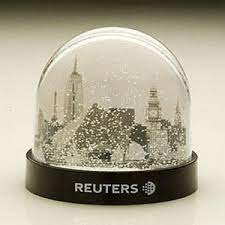
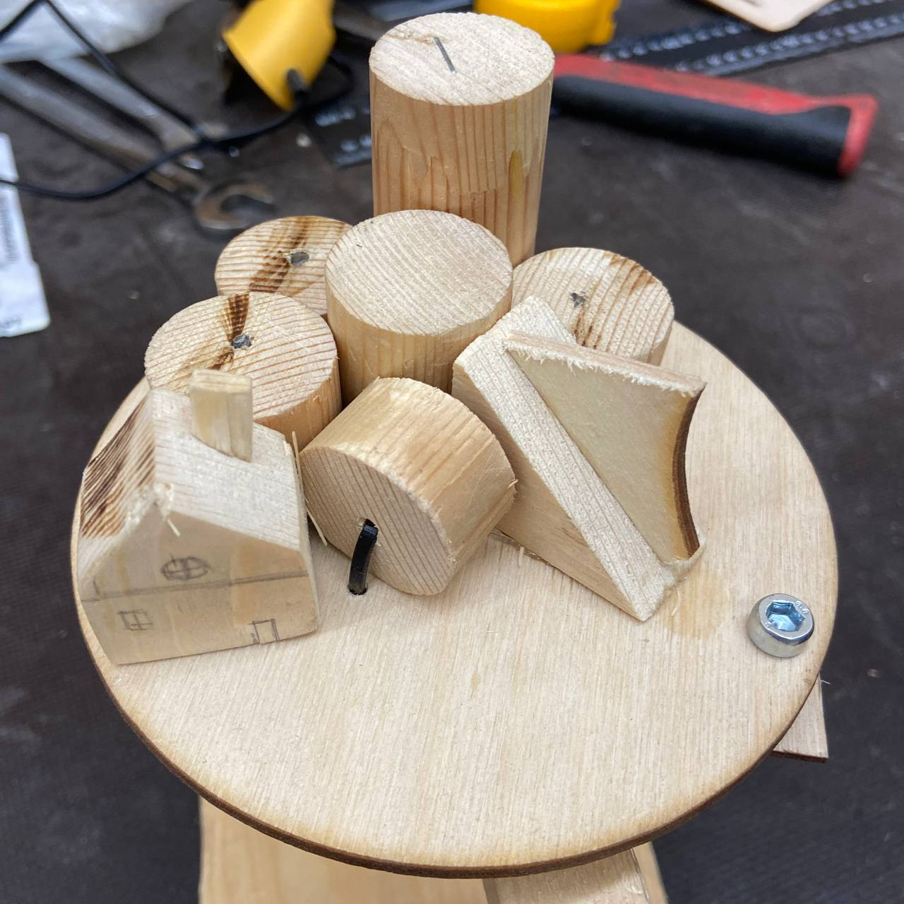

# Totem
## Создание произведения искусства из дерева с помощью различных инструментов

### Исполозованые оборудование и материалы
 * защитные очки и наушники;
 * сверлильный станок;
 * ножовка или дремель или мини-болгарка;
 * лобзик или реноватор;
 *саморезы;
 * болты и гайки (но не слишком много);
 * надфили (напильники);
 * ножницы по металлу;
 * шуруповерт;
 * стяжки (тоже не слишком много);
 * клей ПВА, клей цианакрилатный, горячий клей;
 * степлер;
 * эпоксидная смола и УФ;
 * какой-то измерительный инструмент (линейка, рулетка, штангенциркуль);

### Производство
[Видео роизводства](https://github.com/Eblyaev/Totem/blob/main/Видео%20производства)

### Разработка
Идеи были направлены в сторону импровизации и подобия внутренностей снежных шаров.

Рисунок 1 - Идея тотема

Рисунок 2 - Результат. Тотем
